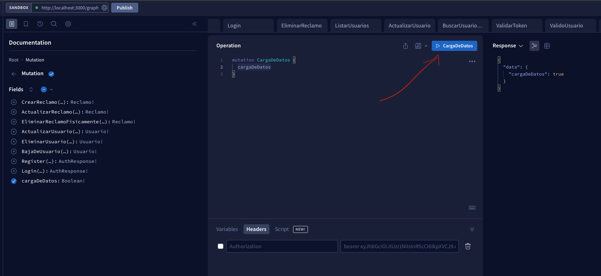
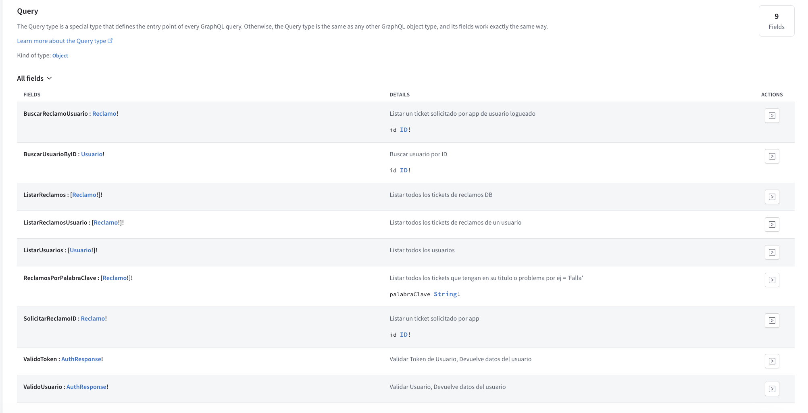
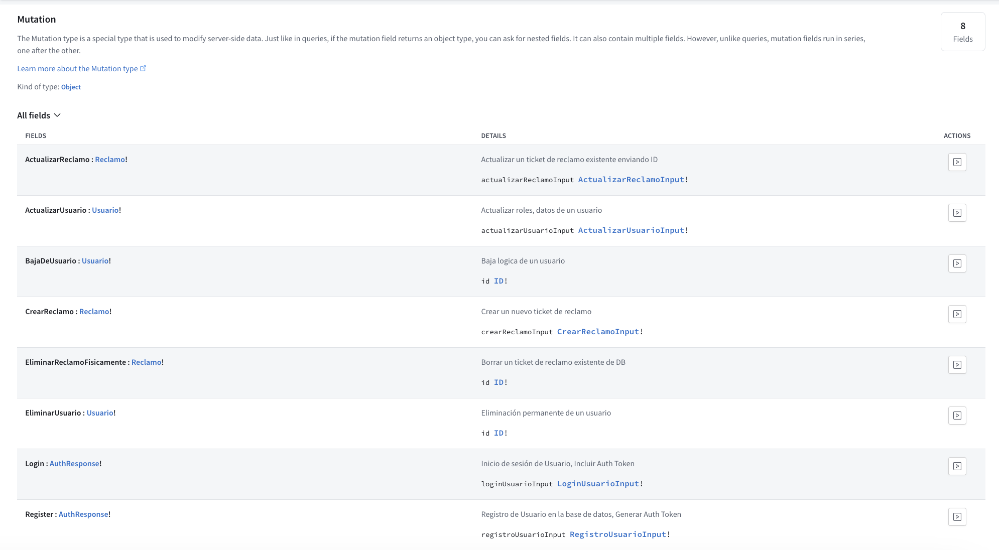
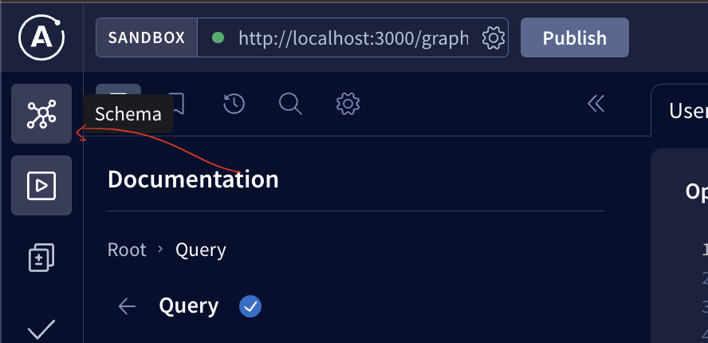
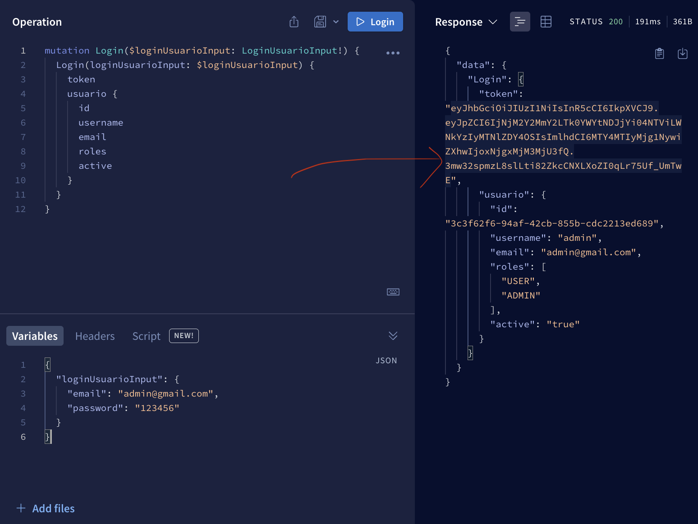
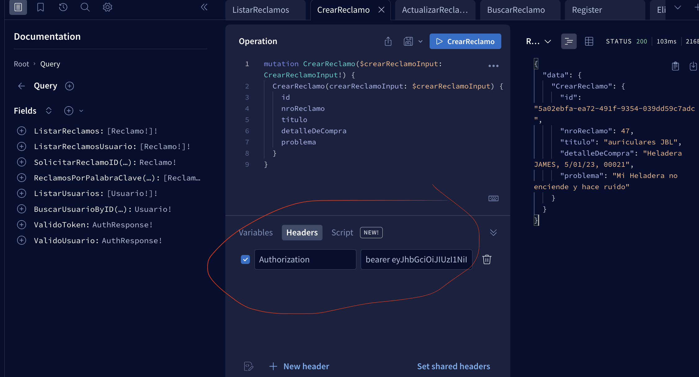

# Proyecto individual entregable
``fecha de entrega:`` 15 de abril

## Tecnologias utilizadas en el proyecto


* ``NestJS``: Framework de NodeJS
* ``GraphQL``: Lenguaje de consulta para APIs
* ``TypeORM``: ORM para NodeJS
* ``PostgreSQL``: Base de datos
* ``Docker``: Contenedores
* ``Docker Compose``: Orquestador de contenedores
* ``AWS``: Servicios de la nube
* ``Terraform``: Automatización de aprovisionamiento

## Letra 


## Desafio Adicional a esto

* Utilizar de alguna manera alguno de los servicios de ``AWS``
* Utilizar de alguna manera la automatización de aprovisionamiento de ``Terraform``

* Hacer testing de la API (última a cosa a investigar personalmente)
* Revisar la parte del bonus. (luego de terminar la parte de aplicar testing)

# Repositorios

Todo mi resolución por historial de commits se encuentra en la siguiente ruta de mi repositorio:
````
sanei1509/cencosud-bootcamp/Graphql/reclamos app
````

### ``URL``
* [Repositorio](https://github.com/sanei1509/cencosud-bootcamp/tree/master/GraphQL/reclamos-app)

## Para que un tercero (usted) pueda clonarlo tuve que crear un un repositiorio individual

### ``URL``
* [Repositorio](https://github.com/sanei1509/reclamos-app)


# Hay dos maneras de correr la aplicación

## ``1. Con Docker:``
se levanta la base de datos y el servidor en un solo comando

## ``2. Con servicio AWS (RDS)``
se levanta el servidor y se conecta a la base de datos en AWS

# INSTRUCCIONES (1) CON DOCKER
## Para poder desplegar en tu maquina local

* Instalar ``NodeJS`` y ``Yarn``
* Instalar ``Docker`` y ``Docker Compose``

* Clonar el repositorio

````
git clone HTTPS_DEL_REPO
````

* Instalar las dependencias

````
yarn install
````

* Crear archivo ``.env`` y copiar el contenido de ``.env-template-postgres-docker``

* Levantar la base de datos
 
````
docker-compose up -d
````
``-d`` para que se ejecute desacoplada de la terminal


* Levantar el servidor
``directorio``: parado en ``/reclamos-app``
````

yarn start:dev
````

* Abrir el navegador en ``http://localhost:3000/graphql``
* Para ver la documentación de la API, ir a ``http://localhost:3000/graphql``

* Ejecutar el ``SEED`` , carga de datos ficticios en la base de datos

Para eso vas a tener que ejecutar el mutation que indico aqui debajo



## image


# INSTRUCCIONES (2) CON SERVICIO AWS (RDS)

## Para poder desplegar en tu maquina local

* Instalar ``NodeJS`` y ``Yarn``

* Clonar el repositorio

````
git clone HTTPS_DEL_REPO
````
* Instalar las dependencias

````
yarn install
````
* Crear archivo ``.env`` y copiar el contenido de ``.env-template-postgres-aws``


* Levantar el servidor
``directorio``: parado en ``/reclamos-app``
````
yarn start:dev
````

* Abrir el navegador en ``http://localhost:3000/graphql``
* Para ver la documentación de la API, ir a ``http://localhost:3000/graphql``


* Ejecutar el ``SEED`` , carga de datos ficticios en la base de datos

Para eso vas a tener que ejecutar el mutation que indico aqui debajo


## Requerimientos

Acciones CRUD para la entidad Reclamo

- obtener todos los reclamos
- obtener un reclamo por id
- actualizar un reclamo por id
- borrar un reclamo por id
- buscar reclamos por palabra clave (descripcion, problematica)
- obtener una lista de reclamos filtrados por palabra clave. (descripcion, problematica)


## Modelo de reclamos

```json
{
  "idReclamo": 1,
  "descripcion": "El producto no funciona",
  "detalleCompra": "fechaCompra, nroFactura, codigoProducto", //Solicitado de 3 inputs distintos
  "problematica": "El producto no funciona",
}
```
# Decisiones para crear el proyecto

## Tenemos 2 opciones utilizar ``SCHEMA FIRST`` O ``CODE FIRST``
 - [Schema First](https://docs.nestjs.com/graphql/quick-start#schema-first)
  - [Code First](https://docs.nestjs.com/graphql/quick-start#code-first)

  CODE FIRST : es más sencillo de implementar si dominas nest, como es nuestro caso.

  Se podría escribir directamente los tipos con  graphql, pero NestJS nos permite usar Typescript para definir los tipos y que luego se ``traduzcan`` a graphql.

## Todos los servidores que se ejecutan con GraphQL necesitan al menos tener un ``RESOLVER`` que ejecute una ``QUERY`` o ``MUTATION``.

## En nuestro caso vamos a tener 3 resolvers

1. Resolver para ``Reclamo``

2. Resolver para ``Usuario``

3. Resolver para ``Auth``

Nos vamos a comunicar con los usuarios a atraves de ``Auth`` para que recién puedan regitstrarse/loguearse y crear reclamos.

## Diferencia entre REST y GraphQL

REST: solicitamos todo el recurso y luego filtramos lo que necesitamos.

GRAPHQL: solicitamos solo lo que necesitamos,  una petición personalizada.


## Validaciones de datos ingresados
para asegurarnos de no guardar datos no deseados en nuestra base de datos vamos a intentar abarcar lo mejor posible las validaciones de datos.


# Autorización y Autenticación

``Autorización``: es la capacidad de un usuario para acceder a un recurso.

``Autenticación``: es la capacidad de un usuario para identificarse.

Vamos a implementar ambas en la aplicacion de la mano de ``JWT``,

1. Crear una sistema de REGISTRO.

2. Crear un sistema de LOGIN: que nos devuelva un token.

3. Crear un sistema de AUTORIZACION: que nos permita acceder a los recursos.

# Reglas   &   Lógica de la aplicación

 - Si la persona ``no esta logueada``, no puede hacer ninguna petición.

 - Si la persona ``esta logueada``, puede ver sus reclamos y crear reclamos.

 - Si la persona es ``ADMIN``, puede ver los reclamos (DB), ``crear`` / ``actualizar`` / ``borrar`` reclamos.

- Cada usuario ``USER`` con su token podrá ver sus reclamos. pero no todo de la base de datos.

- Cada usuario ``ADMIN`` con su token debería poder ver todos los reclamos de la base de datos además de los suyos. 

## Al contar con autorizacion

Primero recordemos como mencionamos anteriormente que para comunicarnos con la aplicación utilizaríamos la ``interfaz de apollo`` (plugin) que nos crea no solo la interfaz gráfica, sino una pequeña documentación de la API.

Accedemos a ella luego de correr la aplicación como vimos antes:

``http://localhost:3000/graphql``

## Aqui puede visualizar todas las operaciones de la app y cierta descripción de cada una.

dividido en 2 partes:

``Query``: operaciones de lectura



``Mutation``: operaciones de escritura



Para entrar debemos ir a  "Schemas" aqui:




## Para poder acceder a las operaciones de la API, necesitamos un token de autenticación.

el token se obtiene como respuesta al loguearse o registrarse.



Lo incluimos en el header como se muestra en la imagen siguiente:



## Mi intención:

### OPERACIONES ADMIN
Quize crear operaciones para usuarios ADMIN que son consultas generales en la base de datos

### OPERACIONES USER
Crear operaciones para usuarios que son consultas especificas de ese usuario que esta utilizando la aplicación en particular.


# Autor

* Santiago Neira


